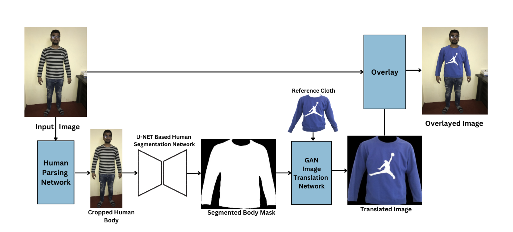
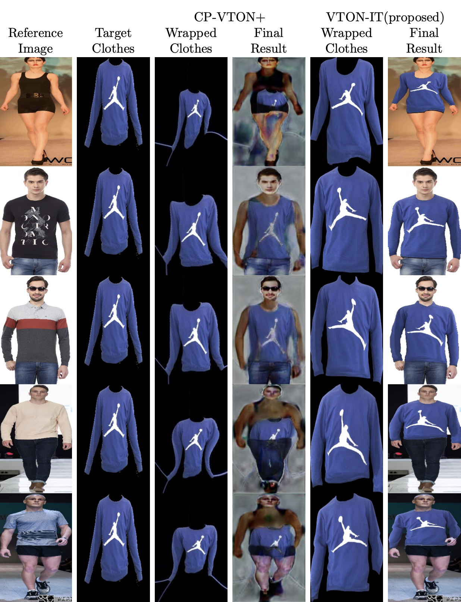

<h1 align="center">
  VTON-IT: Virtual Try-On using Image Translation
</h1>

<div align="center">
  <a target="_blank" href="https://arxiv.org/pdf/2310.04558.pdf"><b>Paper</b></a>&nbsp&nbsp |
  <a href="https://github.com/shuntos/VITON-IT/">&nbsp&nbsp<b>Github</b></a>&nbsp&nbsp |
  <a target="_blank" href="https://www.youtube.com/watch?v=sYdoLNQOzsk">&nbsp&nbsp<b>Video</b></a>
</div>

<br/>
<p>
 This paper introduces VTON-IT, a novel Virtual Try-On application that uses semantic segmentation and a generative adversarial network to produce high-resolution, natural-looking images of clothes overlaid onto segmented body regions, addressing the challenges of body size, pose, and occlusions.
</p>

<p>
Below is the overview of proposed VTON-IT. First, the human body is detected and cropped. Then, the desired body region is segmented through U2-Net architecture and the segmented mask is fed to the image translation network to generate wrapped cloth. Finally, the wrapped cloth is overlayed over the input image.
</p>

<p align="center">

</p>

## Result

For evaluating the performance of VTON-IT through visual observation, we compared the final overlayed images with the output of CP-VTON+. Image below shows that the proposed virtual try-on application produces more realistic and convincing results in terms of texture transfer quality and pose preservation.

<p align="center">

</p>

## Requirements

- python 3.6.13
- torch 1.1.0 (as no third party libraries are required in this codebase, other versions should work, not yet tested)
- torchvision 0.3.0
- tensorboardX
- opencv

## Training Pix2pix:

```
 python3 train.py --label_nc 0 --no_instance --name vd2.0_2  --dataroot ./datasets/vd2.0_2 --continue_train   --gpu_ids 0,1 --batchSize 2
```

## Train Segmentation model

```
u2net_train.py

```

## Inference

```
Inference.py
```

## Reference

If you find our paper and code useful in your research, please consider giving a star ⭐ and citation 📝 :)

```
@misc{adhikari2023vtonit,
      title={VTON-IT: Virtual Try-On using Image Translation},
      author={Santosh Adhikari and Bishnu Bhusal and Prashant Ghimire and Anil Shrestha},
      year={2023},
      eprint={2310.04558},
      archivePrefix={arXiv},
      primaryClass={cs.CV}
}
```

## Acknowledgements

The authors would like to thank IKebana Solutions LLC for providing them with constant support for this research project.
